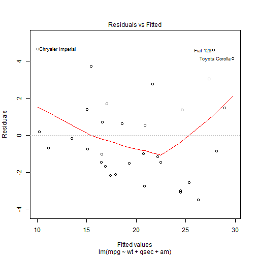
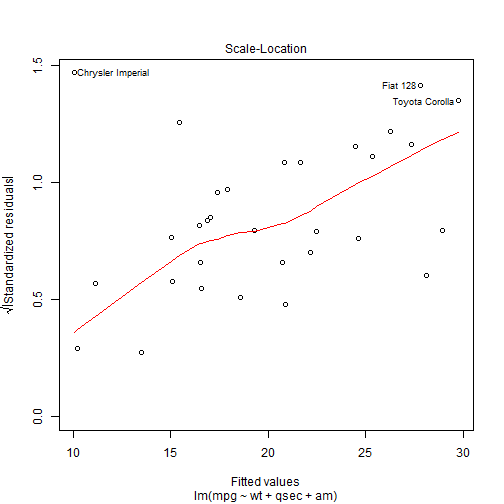

## Executive Summary

I have selected the model using the Multi variable regression approach since there are more than one independent variables which dependent variable depends.


## Simple relationship between mpg and transmission 

Following plot shows the relationship between the mpg and transmission and as per the plot cars those have automatic transmission provide mileage per gallon.


```r
plot(x=factor(mtcars$am), y = mtcars$mpg, par=19, col="blue", xlab="Transmission", ylab="MPG")
```

 

Next we will be analysing the data and provide the relationship between the other variables to MPG.

## Linear Regression with Multiple predictors

Different approaches can used to select the model. 


Basic Model:

y= b0 + b1x1 + b2x2 +....+bpxp + ei; i= 1 ...n

# Unknown Parameters

b0: overall mean
bk: k=1 ...,p: regression coefficients


## Model Selection Steps
Model selection was done using the backward elimination process : which involves starting with all candidate variables, testing the deletion of each variable using a chosen model comparison criterion, deleting the variable (if any) that improves the model the most by being deleted, and repeating this process until no further improvement is possible


```r
round(cor(mtcars),3) 
```


```r
model_a<- lm(mpg~.,data=mtcars)
model_b<- lm(mpg~disp+hp+drat+wt+qsec+vs+am+gear+carb,data=mtcars) #Removed Cyl

#Added Cyl and Removed vs becauss these were highly correlated and we need to select one of these.
model_c<- lm(mpg~cyl+disp+hp+drat+wt+qsec+am+gear+carb,data=mtcars) 


## Now Remove variable which have highest p values until we get variables with p values 0.05

model_c<- update(model_c,.~.-cyl)
model_c<- update(model_c,.~.-carb)
model_c<- update(model_c,.~.-gear)
model_c<- update(model_c,.~.-drat)
model_c<- update(model_c,.~.-disp)
model_c<- update(model_c,.~.-hp)

## Final Model Summary

summary(model_c)
```

```
## 
## Call:
## lm(formula = mpg ~ wt + qsec + am, data = mtcars)
## 
## Residuals:
##    Min     1Q Median     3Q    Max 
## -3.481 -1.556 -0.726  1.411  4.661 
## 
## Coefficients:
##             Estimate Std. Error t value Pr(>|t|)    
## (Intercept)    9.618      6.960    1.38  0.17792    
## wt            -3.917      0.711   -5.51    7e-06 ***
## qsec           1.226      0.289    4.25  0.00022 ***
## am             2.936      1.411    2.08  0.04672 *  
## ---
## Signif. codes:  0 '***' 0.001 '**' 0.01 '*' 0.05 '.' 0.1 ' ' 1
## 
## Residual standard error: 2.46 on 28 degrees of freedom
## Multiple R-squared:  0.85,	Adjusted R-squared:  0.834 
## F-statistic: 52.7 on 3 and 28 DF,  p-value: 1.21e-11
```


## Fitted Values and Residuals


```r
FinalDF<-data.frame(mtcars , fitted.value = fitted (model_c) , residual = resid(model_c))
```
#Analysis of Variance 


```r
anova(model_c)
```

## Diagnostics & Exploratory Analysis


```r
plot (model_c , which =1:5)
```

     


